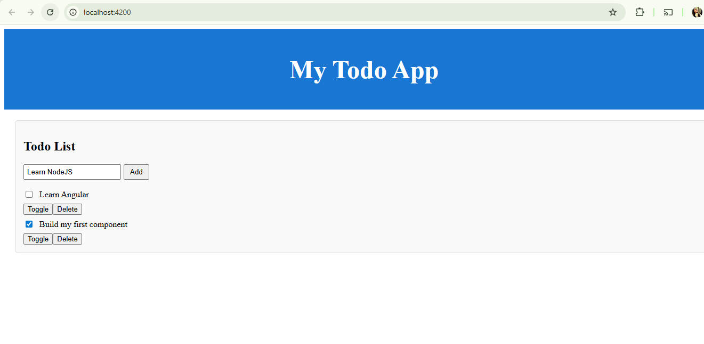
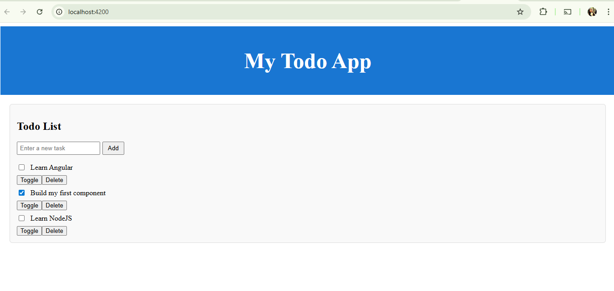

# Angular Todo App

A simple Angular application I built while learning Angular fundamentals.  
This app allows users to:
- Add new tasks
- Toggle task completion
- Delete tasks

## 🚀 Tech Stack
- Angular (v21.2.5)
- TypeScript
- Angular CLI

## 📂 How to Run
1. Clone the repo:
   ```bash
   git clone https://github.com/neetiat/angular-todo-app.git
2. Install dependencies:
    npm install
3. Start the app:
    ng serve
Open http://localhost:4200 in your browser.


